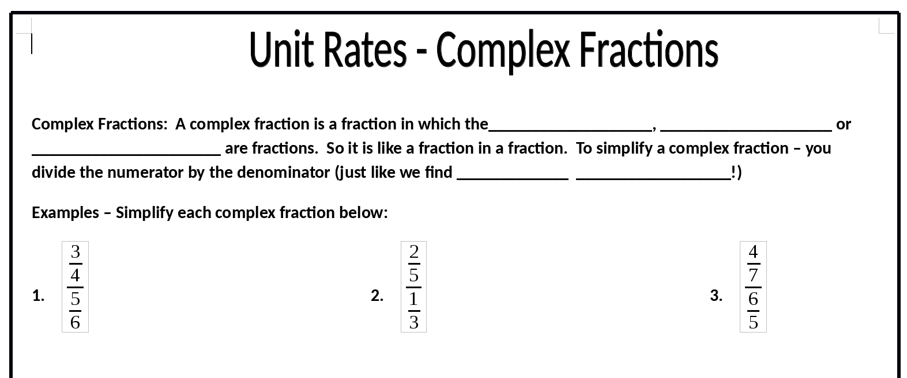
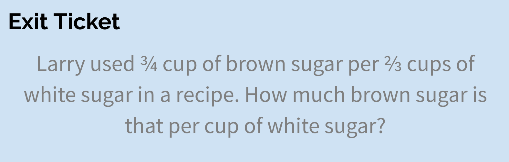
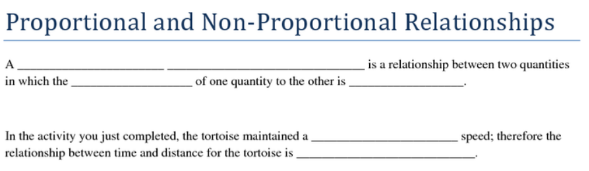
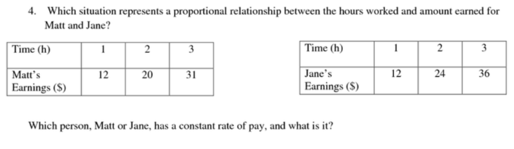

<object data="images/grand.svg" type="image/svg+xml">
  
</object>
# Rational numbers

Look at the foldable below and review how to add and subtract positive and negative numbers.

## Notes on addition
We can add positive and negative integers using a number line.

## Notes on subtracting a negative number
Why is *subtracting* a **negative** the same as *adding* a **positive**? 
What happens when you take away a debt? See the video [here](https://www.khanacademy.org/math/arithmetic/arith-review-negative-numbers/arith-review-sub-neg-intro/v/why-subtracting-a-negative-equivalent-to-adding-a-positive).

[Operations with Integers Quiz](https://share.quizizz.com/join?c=931275da14a6b7310bdf18713406c7aacf1ff19618e4e9de829fa76c76eb75b07fd42734ffeed9a8c477ec4b5167de3d0cd7ffc153a318cc14e97cf9ea653d1aafdb12020bc75c7553199d7492073fa95d3fe6e7b541c4b8f8c8bec2c582e835d86b2301f11857181849a5b28bc8aeca7080c33acb17b2afb839aef12727b37327346049e3d2fa754d94384bd6efcbe296f759c4393368cf1da7aebb56ab518ffa907f52a71e4b9f0d08289d0c1a9532)

## Notes on multiplication and division

Can you see how this picture helps you multiply and divide positive and negative numbers?

## Order of Operations

[Order of operations practice](https://www.khanacademy.org/math/pre-algebra/pre-algebra-arith-prop/pre-algebra-order-of-operations/e/order_of_operations_2)

# Unit rates

<!---->

# Proportional relationships

    ## Constant of proportionality
    ## Graphs of proportional relationships

# Percents
    ## Markups and markdowns
    ## Percent increase and decrease

# Expressions
    ## Combining like terms
    ## Expanding using the distributive property
    ## Factoring using the distributive property
    ## Adding and subtracting linear expressions

# Equations
    ## One-step
    ## Two-step
    ## Solving real-world problems using equations

# Inequalities

# Order of operations review

[Adding and subtracting rational numbers practice](https://www.khanacademy.org/math/in-in-class-7th-math-cbse/in-in-7th-rational-numbers/in-in-7th-rational-nos-add-sub/e/adding_and_subtracting_rational_numbers)
[Multiplying and dividing rational numbers](https://www.khanacademy.org/math/cc-seventh-grade-math/cc-7th-negative-numbers-multiply-and-divide/cc-7th-mult-div-neg-fractions/e/multiplying_fractions)
[More Order of operations practice](/slides/oo.rem)
[Order of operations quiz review](/slides/oo_quiz.rem)

# Unit 1 resources

 * [Unit 1 review slides](/doc/unit1review.rem)
 * [Adding and subtracting rational numbers practice](/doc/unit1/adding_subtracting_rational_numbers_relay_race.pdf) [Solutions](/doc/unit1/solutions.pdf)
 * [Adding, Subtracting, Multiplying, and Dividing Integers Quiz](/doc/unit1/quiz3.pdf)

# Notes

 * [Adding and subtracting rational numbers](/notes/adding_subtracting_rational_numbers.pdf)
 
# Classwork

 * [Adding and subtracting integers using number lines](/doc/adding_subtracting_with_number_lines.pdf)
 * [Finding distances exit ticket](/doc/CW1.pdf)
